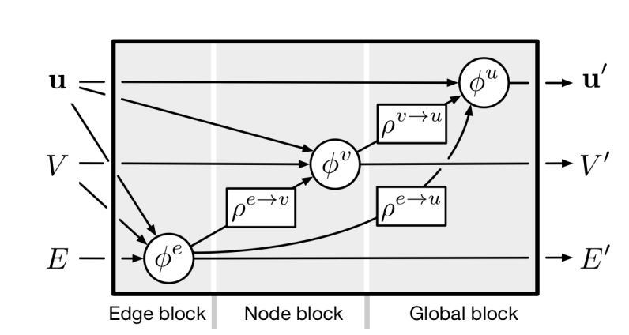

# a-dgl-implementation-for-GN-graph-network-framework-
(from the paper 'Relational inductive biases, deep learning, and graph networks')

node/rel/global representation update:

input:  dgl homogeneous graph (or transfered from heterogeneous graph), node features, edge features, edge types and global feature.
output: updated node/edge/global features.
